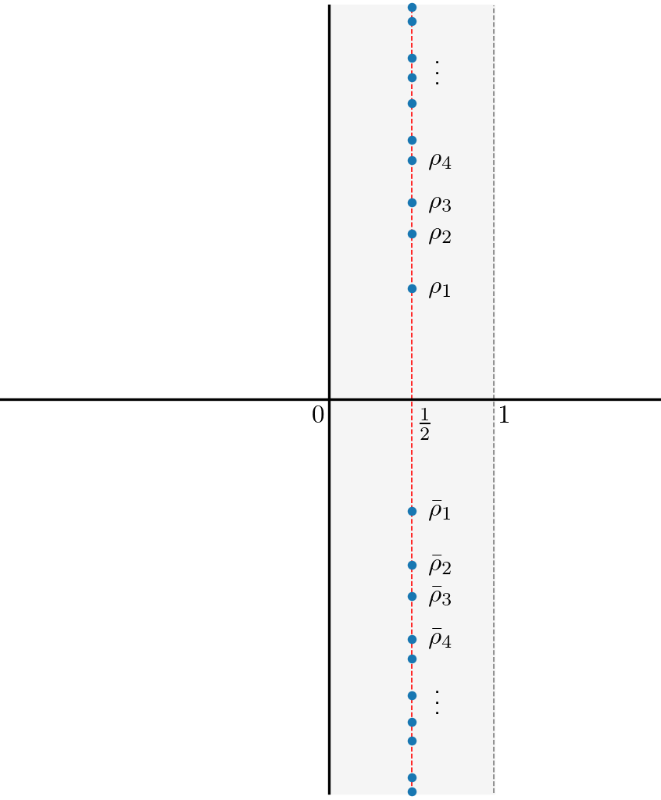

# Zero-based approximation of the Riemann zeta function

This project delves into the [*Riemann zeta function*](https://en.wikipedia.org/wiki/Riemann_zeta_function), a cornerstone of number theory due to the remarkable connection between its zeros and the distribution of prime numbers. The exact location of its zeros constitutes the renowned [Riemann hypothesis](https://en.wikipedia.org/wiki/Riemann_hypothesis).

This project focuses on a sequence of complex functions conceived by [Y. Matiyasevich](https://en.wikipedia.org/wiki/Yuri_Matiyasevich) as efficient approximations of $\zeta$. Our goal is to fully elucidate the nature of the approximation error by **analyzing vast datasets** and thereby uncover new insights into the Riemann zeta function. 

## Overview

The code in this repository –written in Python and Julia– generates the numerical data that defines Matiyasevich's approximations of the Riemann zeta function, as introduced in the references [^mat13] and [^mat16], and then computes the approximation errors. The next section of this README introduces the mathematical objects involved in this code, and the subsequent one gives an overview of the various scripts in the repository and their key functions.

[^mat13]: Y. Matiyasevich. *Calculation of Riemann's zeta function via interpolating determinants.* Preprints of MPIM in Bonn, 2013.  [http://www.mpim-bonn.mpg.de/preblob/5368](http://www.mpim-bonn.mpg.de/preblob/5368).
[^mat16]: Y. Matiyasevich. *Riemann’s zeta function and finite Dirichlet series.* St. Petersburg Math. J. 27 (2016), 985-1002. [https://www.ams.org/journals/spmj/2016-27-06/S1061-0022-2016-01431-9/](https://www.ams.org/journals/spmj/2016-27-06/S1061-0022-2016-01431-9/)

To handle computational instability in our calculations, we maintain high precision in our floating-point numbers, generally requiring around $10^5$ or more decimal digits. This can be achieved using **arbitrary-precision floating-point arithmetic**, available in Python through the `mpmath` package, and in Julia through its native `BigFloat` type. 

The need for arbitrary precision resulted in significant performance issues, which we addressed by (i) implementing the most computationally intensive parts of the code in **Julia**, and (ii) **parallelizing** whenever feasible. 

The Python function `mpmath.zetazero`, which has no equivalent in Julia, calculates the critical-line zeros of $\zeta$ with a specified precision. While it is feasible to call a Python function in Julia using `PyCall`, it does not appear possible to parallelize a function in this context. This explains our choice of Python for this specific part of the code. 

## Mathematical objects in the code

The Riemann zeta function $\zeta$ is defined as the infinite sum 

$$\zeta(s) = \sum_{n=1}^{+\infty} n^{-s}$$ 

for every complex number $s$ with $\mathrm{Re}(s) > 1$. This function has a pole at $s=1$ and can be extended analytically to the entire complex plane. The function $\zeta$ vanishes at all negative even numbers, known as its *trivial* zeros. The remaining zeros (a.k.a. the *non-trivial* ones) are known to lie within the strip of complex numbers $s$ with $0 < \mathrm{Re}(s) < 1$. The Riemann hypothesis predicts that all the non-trivial zeros lie on the *critical line* $\lbrace s \mid \mathrm{Re}(s) = 1/2 \rbrace$. 

Matiyasevich's approximations of $\zeta$ are finite sums of the form $\sum_{n=1}^N \alpha_n \ n^{-s}$ that *interpolate* $\zeta$ based on a finite number of its critical-line zeros. If we denote by $\rho_1, \rho_2, \rho_3, \ldots$ the critical-line zeros with positive imaginary parts, ordered increasingly by their imaginary parts (see image below), then $\zeta$ vanishes on the complex conjugates $\bar\rho_1, \bar\rho_2, \bar\rho_3, \ldots$ as well. 

The approximations[^longnote] are defined in the references [^mat13] and [^mat16] by the formula

[^longnote]: Our notation differs from Matiyasevich's in that our Ω_M(s) functions correspond to the functions Δ_{2M+1}(s) in his articles.

$$\Omega_M(s) = \sum_{n=1}^{2M+1} \delta_{M,n} \ n^{-s}$$

where $M$ is a positive integer, $\delta_{M,1} = 1$, and the rest of the coefficients $\delta_{M,n}$ are defined as the unique solutions to the linear system

$$\Omega_M(\rho_1) = \cdots = \Omega_M(\rho_M) = \Omega_M(\bar\rho_1) = \cdots = \Omega_M(\bar\rho_M) = 0.$$

Despite being defined only from a finite number of zeros, Matiyasevich observed that the approximations $\Omega_M$ "remember" a great deal of information about the Riemann zeta function and have numerous remarkable properties, as described in the two references above. 

In this project, we focus on the quotient

$$\nu_M(s) := \frac{\Omega_M(s)}{\zeta(s)} = \frac{\sum_{n=1}^{2M+1} \delta_{M,n} \ n^{-s}}{\sum_{n=1}^{+\infty} n^{-s}}.$$

By the [Möbius inversion formula](https://en.wikipedia.org/wiki/M%C3%B6bius_inversion_formula), the quotient $\nu_M(s)$ may be written as the infinite sum

$$\nu_M(s) = \sum_{n=1}^{+\infty} \mu_{M,n} \ n^{-s},$$

(see Eq. 93 in [^mat13]) where the coefficients $\mu_{M,n}$ are determined by the formula

$$\mu_{M, n} = \sum_{\overset{{\displaystyle d=1}}{d \mid n}}^{2M+1} \mu\left(\frac{n}{d}\right) \ \delta_{M,d}.$$

and $\mu$ denotes the Möbius mu function. Finally, we consider the finite truncation

$$\nu_{M, K}(s):= \sum_{n=1}^K \mu_{M,n} \ n^{-s}$$

of $\nu_{M}(s)$ (see Eq. 96 in [^mat13]). Both $\nu_M(s)$ and $\nu_{M, K}(s)$ quantify the difference between Matiyasevich's interpolations and the Riemann zeta function. 

Through our data-driven approach, we aim to describe the dependencies of the functions $\nu_M(s)$ and $\nu_{M, K}(s)$ on the parameters $M, K, s$, generating a comprehensive mathematical conjecture. 

## Scripts and functions

Before executing any of the scripts described below, parameters should be adjusted in their `main` functions.

### **`zeta_zeros.py`**

This script returns a list of the imaginary parts of the first $M$ critical-line zeros $\rho_1,\rho_2,\ldots,\rho_M$ of the Riemann zeta function (see [image](./Images/critical.png) above), multi-threading the execution of the function `mpmath.zetazero`.

**Parameters**
* `max_M` (int). Maximal index $M$ of the critical-line zeros to be computed.
* `n_dps` (int). Precision in number of digits.
* `n_cores` (int). Number of cores for multithreading. 

**Output file.**
TXT file containing the imaginary parts of the first `max_M` critical-line zeros with a precision of `n_dps` number of digits, ordered increasingly and separated by new-line characters `\n`. Its path will be <code>~/Data/p<b>[<i>n_dps</i>]</b>/ImZetaZero_M<b>[<i>max_M</i>]</b>_p<b>[<i>n_dps</i>]</b>.txt</code>.

### **`coef_delta.jl`**

This script computes the coefficients $\delta_{M,n}$ (with $n=1, \ldots, 2M+1$) of Matiyasevich's approximation $\Omega_M$ for all $M = 1$, ..., `max_M`, by solving the linear systems corresponding to all of the approximations simultaneously. It is a multi-thread implementation in Julia of the Gauss algorithm without pivots, based on an algorithm due to Beliakov and Matiyasevich (see the reference [^bel]).

[^bel]: G. Beliakov and Y. Matiyasevich. *A parallel algorithm for calculation of determinants and minors using arbitrary precision arithmetic.* BIM Numerical Mathematics 56 (2016), 33–50. 

**Parameters**

* `max_M` (int). Maximal index of $M$ for the approximations $\Omega_M$ to be computed. 
* `max_computed_M` (int). Maximal index of the zeros listed in the input file (see "Input file" below).
* `n_dps` (int). Precision in number of digits. It must coincide with the precision specified in the input file path (see "Input file" below).
* `chunk_size` (int).  Upper bound *in bytes* for the size of output JSON files (see "Output files" below).  

**Input file.**
TXT file (as output by `zeta_zeros.py`) with path <code>~/Data/p<b>[<i>n_dps</i>]</b>/ImZetaZero_M<b>[<i>max_computed_M</i>]</b>_p<b>[<i>n_dps</i>]</b>.txt</code> listing the critical-line zeros of zeta up to index `max_computed_M` with precision `n_dps`.
  
**Output files.**
Dictionary whose keys are integers from 1 to `max_M` and the value at key $M$ is a list of the coefficients $\delta_{M,n}$ for $n = 1, ..., 2M+1$ recorded as strings. The dictionary is split as several JSON files of size in bytes of at most `chunk_size`. The path of the JSON files will be <code>~/Data/p<b>[<i>n_dps</i>]</b>/CoefDelta_M<b>[<i>start</i>]</b>-<b>[<i>end</i>]</b>_p<b>[<i>n_dps</i>]</b>.json</code>, where `start` and `end` denote the key range for the dictionary entries stored in the file.     

### **`nu_scf.jl`**

This script computes the multiplicative error function $\nu_{M, K}(s)$ as defined in the previous section for the ranges `range_M`, `range_K`, `range_s` of the parameters $M, K,s$, respectively. 

**Parameters.**

* `range_M` (StepRange of int). Range of integer values of $M$ for the computation of $\nu_{M, K}(s)$.
* `range_K` (StepRange of int). Range of integer values of $K$ for the computation of $\nu_{M, K}(s)$.
* `range_s` (StepRange of numbers). Range of values of $s$ for the computation of $\nu_{M, K}(s)$ (they may be integers or float).
* `n_dps` (int). Precision in number of digits. It must coincide with the precision specified in the input file paths (see "Input files" below).
* `chunk_size` (int). Upper bound *in bytes* for the size of output JSON files (see "Output files" below).

**Input files.**
JSON files (as output by `coef_delta.jl`) with paths <code>~/Data/p<b>[<i>n_dps</i>]</b>/CoefDelta_M<b>[<i>start</i>]</b>-<b>[<i>end</i>]</b>_p<b>[<i>n_dps</i>]</b>.json</code> listing the coefficients $\delta_{M,n}$ for all the values of $M$ contained in `range_M` with precision `n_dps`. 

**Output files.**
Dictionary whose keys are tuples `(M,K,s)` in the Cartesian product of the ranges `range_M`, `range_K` and `range_s`. The value at key `(M,K,s)` is the value of the function $\nu_{M, K}(s)$. The dictionary is split as several JSON files of size in bytes of at most `chunk_size`. The path of the JSON files is 

<pre> ~/Data/p<b>[<i>n_dps</i>]</b>/nu_M<b>[<i>range_M</i>]</b>_K<b>[<i>range_K</i>]</b>_s<b>[<i>range_s</i>]</b>_p<b>[<i>n_dps</i>]</b>_part_<b>[<i>i</i>]</b>.json </pre>

where the parameter `i` indexes the parts in which the dictionary is divided. If the whole dictionary has size less than `chunk_size`, then it is stored as 

<pre> ~/Data/p<b>[<i>n_dps</i>]</b>/nu_M<b>[<i>range_M</i>]</b>_K<b>[<i>range_K</i>]</b>_s<b>[<i>range_s</i>]</b>_p<b>[<i>n_dps</i>]</b>_part_<b>[<i>i</i>]</b>.json </pre>

without `i` parameter. The ranges are written in the format `[start]-[step]-[end]`.
